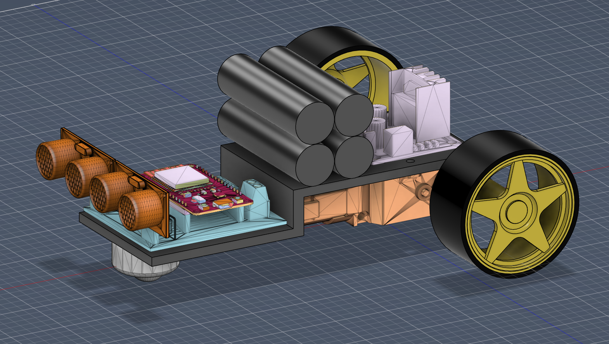
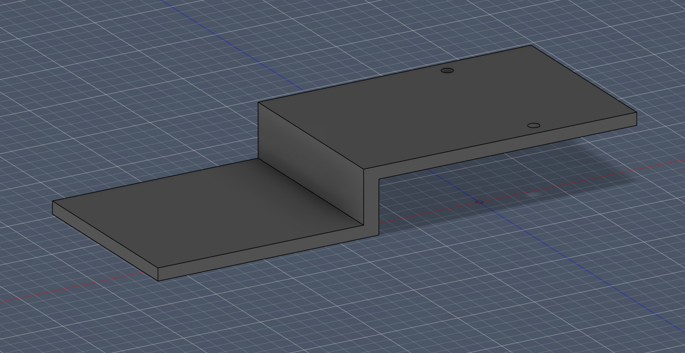
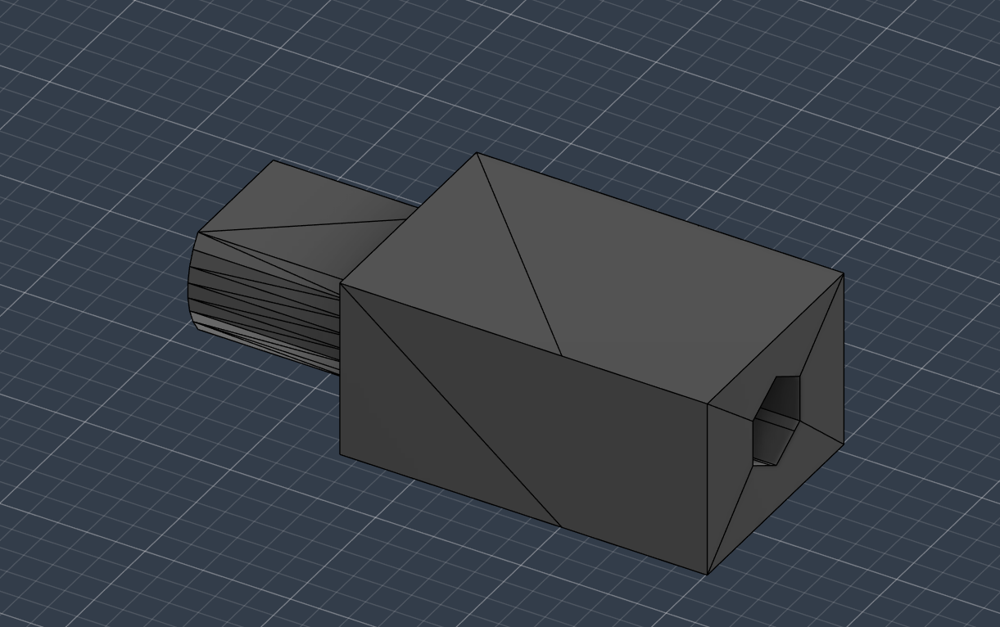

# 🏗️ Estrutura do Robô

**Responsável:** Pietro Pazini

O Fusca Azul utiliza uma base genérica já disponível na ERUS, combinada com peças modeladas e impressas em 3D para completar a montagem.

## 🧱 Montagem do protótipo

A base genérica foi escolhida para economizar filamento e porque a PCB ainda não estava pronta no momento da montagem. Mesmo assim, ela atendeu bem às necessidades do projeto:

- O **motor** foi fixado com parafusos na própria base.
- A **roda boba** foi distanciada da base para nivelar o robô e dar mais estabilidade.
- Os demais componentes (**baterias**, **protoboards**) foram colados com **fita dupla-face**.

<p align="center">
  
  
</p>

## 🖥️ Modelagem 3D

As peças foram modeladas no **Autodesk Fusion 360**. O arquivo do projeto completo está disponível em [`Fusca Azul.f3z`](../modelo3d/Fusca%20Azul.f3z).

<p align="center">
  
</p>

### Componentes externos

Alguns componentes foram baixados como modelos prontos da internet e importados no Fusion 360:

- ESP32
- Ponte H (L298N)
- Sensor ultrassônico (HC-SR04)
- Twin Motor Gearbox

Todos foram verificados para garantir que estavam na **escala correta** em relação às peças modeladas pela equipe.

A **roda** [`Roda.f3d`](../modelo3d/Roda.f3d) foi modelada do zero para ficar mais fiel à realidade.

### Base personalizada

A base personalizada ([`base.stl`](../modelo3d/base.stl)) foi projetada para substituir a base genérica e acomodar todos os componentes de forma integrada:

- Bateria
- Ponte H (L298N)
- PCB (que já integra os sensores e a ESP32)
- Motor e roda boba

O modelo possui um **desnível de altura proposital**: a parte frontal é mais baixa para posicionar os sensores ultrassônicos mais perto do chão, cobrindo melhor a área à frente do robô.

<p align="center">
  
</p>

### Adaptador de roda

O adaptador de roda ([`adaptador.stl`](../modelo3d/Adaptador_roda_v5.stl)) acopla as rodas ao eixo do motor. Passou por **5 versões**, com ajustes progressivos na largura da seção que entra no eixo e no diâmetro do encaixe.

| Versão | Impressões | Observação |
|---|---|---|
| v1 | 1 | Primeiro protótipo para validar o conceito |
| v4 | 4 | Ajustes dimensionais no eixo |
| v5 | 4 | Versão final — encaixa perfeitamente na roda e no eixo do motor sem necessidade de lixar |

As versões v2 e v3 foram apenas ajustes no modelo, sem necessidade de impressão. Ao todo, foram impressos **9 adaptadores** (2 sobressalentes, conforme recomendação do Artur Cunha).

<p align="center">
  
</p>

## 📂 Arquivos do projeto

```
modelo3d/
├── Fusca Azul.f3z         # Projeto completo no Fusion 360
├── Roda.f3d               # Modelo da roda (modelada do zero)
├── base.stl               # Base personalizada (não impressa)
└── Adaptador_roda_v5.stl  # Adaptador de roda (versão final)
```

## 💡 Lições aprendidas

- **Domínio do Fusion 360** — o projeto foi uma oportunidade de aprender e praticar modelagem 3D no Fusion, desde importação de componentes externos até a criação de peças do zero.
- **Uso da impressora 3D** — segui o fluxo completo de impressão: exportação de STL, ajuste de posição para minimizar o volume do suporte, fatiamento, configurar a impressora e observação da impressão para evitar erros.
- **Organização dos componentes** — planejar onde cada peça fica no robô exige pensar em distribuição de peso, equilíbrio, centro de gravidade e acessibilidade para manutenção. O desnível da base, por exemplo, surgiu da necessidade de posicionar os sensores mais baixo sem comprometer a estabilidade.
