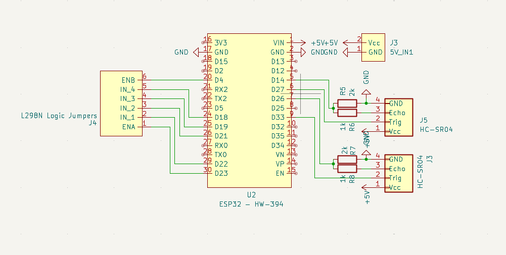

# ⚙️ Hardware

O robô é construído com:

- 1 Esp32
- 2 Sensores Ultrassônicos - HC-SR04
- 1 Ponte H - L298N
- 4 Resistores simples (2 de 1k ohm e 2 de 2k ohm)
- 1 Bateria de ~7.7v
- 2 Motores de ~3v

O schematic e o desenho da pcb feito no KiCad está [aqui](../pcb/).

## 🔗 Conexão

Esse é o schematic das conexões da PCB.

Os motores e a bateria são conectados direto na Ponte H, e é utilizada a saida regulada de 5v. O GND é compartilhado por todos os componentes.

## 💡 Escolhas

- Foi utilizada a saída regulada de 5v da Ponte H para alimentar tanto o Esp32 quanto os dois sensores por ser uma saída estabilizada e porque seria necessária mais tensão para conseguir alimentar os dois motores com a voltagem necessária.

- Foi utilizado um redutor de tensão com os resistores no pino de echo dos sensores pois os pinos de dados do esp32 trabalham em 3.3v e o echo trabalha em 5v, o que pode danificar o esp32.

## 🔧 Pontos a se melhorar

- O robô possui naturalmente uma diferença de voltagem entre as saídas dos 2 motores, o que faz ele andar pendendo para algum lado. Isso foi "consertado" via código, mas poderia ser resolvido utilizando: ou 1 ponte H diferente, ou um redutor externo. Ambas soluções foram tentadas, mas não conseguimos colocar em prática.

## 🎓 Lições Aprendidas

- Foi uma ótima experiência para aprender a mexer com o KiCad e com schematics e afins
- Também foi uma ótima experiência para aprender mais sobre eletrônica e circuitos elétricos

